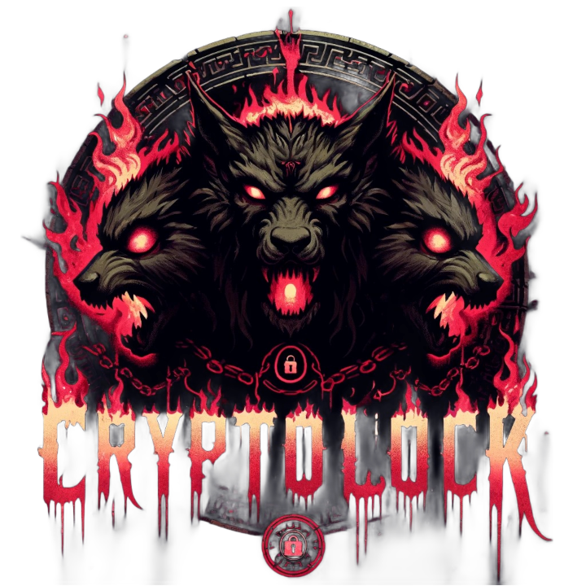
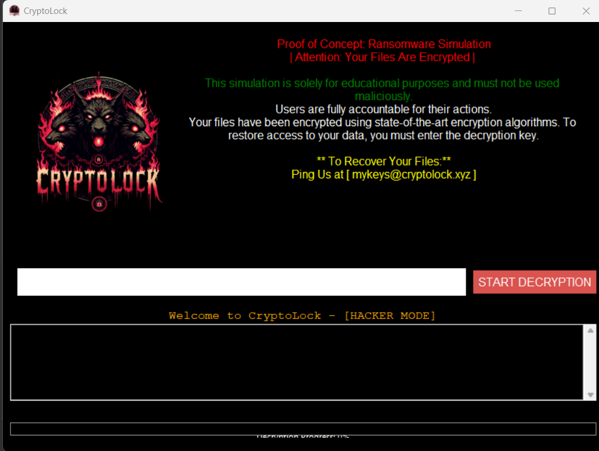

<p align="center">
  
</p>

<p align="center">
  
</p>

<p align="center">
  
</p>

<h1 align="center">🛡️ Ransomware-POC</h1>

<p align="center">
  <strong>⚠️ For Educational Use Only — Ethical Ransomware Simulation Project</strong><br>
  A professionally documented ransomware proof-of-concept tool designed for <br>
  <b>cybersecurity research</b>, <b>red-team simulation</b>, and <b>academic demonstration</b>.
</p>

---

## ✨ Overview

This project is a two-part educational ransomware simulation:

- 🐍 A **Python GUI** that mimics ransomware behavior — encrypts files and simulates a victim-facing interface.  
- 🌐 A **PHP-based Command & Control (C2) dashboard** that logs encryption keys, manages signals, and acts as the attacker interface.

✅ **Fully safe** – No destruction, no propagation. Strictly for training and lab use.

---

## 📁 Folder Structure

```
Ransomware-POC/
├── simulator_gui/
│   ├── rans.py
│   ├── gui.py
│   ├── Simple-Encryption.py
│   ├── Simple-Decryption.py
│   ├── logo.ico
│   └── img/
├── control_panel/
│   ├── public/
│   ├── includes/
│   ├── uploads/
│   └── assets/
├── Screenshots/
│   ├── cryptolock_logo.png
│   └── cryptolock_gui.png
├── README.md
├── LICENSE
├── ETHICS.md
├── .gitignore
```

---

## ✅ Features

| 🧩 Module             | ⚙️ Key Features                                                  |
|----------------------|------------------------------------------------------------------|
| 🐍 Python Simulator  | AES-256 encryption, GUI interface, fake ransomware behavior      |
| 🌐 PHP C2 Panel      | Web dashboard, key logging, login panel, simulated API signaling |
| 🔄 Safe Logic        | Reversible encryption/decryption, no propagation                 |
| 📡 Communication     | Simulates attacker ↔ victim API interaction flow                 |

---

## ⚙️ How to Run It

### 🐍 Python GUI

```bash
cd simulator_gui
python rans.py
```

This launches the GUI simulator, encrypts the victim folder, and optionally sends a key image to the C2 panel.

---

### 🌐 Command & Control (PHP)

1. Place `control_panel/` into `htdocs` in XAMPP/WAMP
2. Start Apache
3. Visit:  
   ```
   http://localhost/control_panel/public/login.php
   ```
4. Log in to access the dashboard, key logs, uploads

---

## 📸 Preview

> Safe demonstration of CryptoLock GUI simulation (for ethical and educational purposes only):

<p align="center">
  
</p>

<p align="center">
  <em>CryptoLock ransomware simulator — locked desktop view</em>
</p>

---

## 📚 Learn the Full Project on Udemy

🎓 This GitHub project is part of the official course:

🔗 **[Ethical Hacking: Build Ransomware with Control Center POC](https://www.udemy.com/course/ethical-hacking-build-ransomware-with-control-center-poc/)**

### 🧠 What You'll Learn

- Build a full ransomware POC in Python
- Create Command & Control logic in PHP
- Use APIs, EXE wrappers, steganography
- Deploy in isolated ethical labs
- Gain insights into real-world ransomware flow

📦 Course Includes:
- 9 hours of expert video tutorials  
- Full source code with documentation  
- PDF guide + downloads  
- Lifetime access & certificate

⭐ 4.8 ★ | 394+ Students Enrolled

---

## 🔐 Use Cases

- 🎓 Red-team training simulations
- 🧠 Ethical hacking bootcamps
- 🔍 Malware emulation research
- 🧪 Safe academic or enterprise labs

---

## 🚀 Future Enhancements

- [ ] Victim tracking dashboard
- [ ] WebSocket control integration
- [ ] Dummy IP geo visualization
- [ ] Email-based command trigger

---

## ⚠️ Disclaimer

This tool is built for **educational and ethical cybersecurity** purposes only.

🚫 You may **NOT** use this for:
- Real-world attacks
- Unauthorized access
- Activity outside secure lab environments

> The developer **Mr. Hex** and contributors **disclaim all liability** for any misuse.

---

## 📜 License

Licensed under the [MIT License](LICENSE).

---

## 🙌 Credits

Developed by **Mr. Hex**  
GitHub: [@hexa-bin](https://github.com/hexa-bin)

Inspired by cybersecurity educators, red-team mentors, and ethical hackers worldwide.

---

<p align="center"><b>Built for Labs 🧪 | Powered by Python 🐍 | Secured by Ethics 🛡️</b></p>
